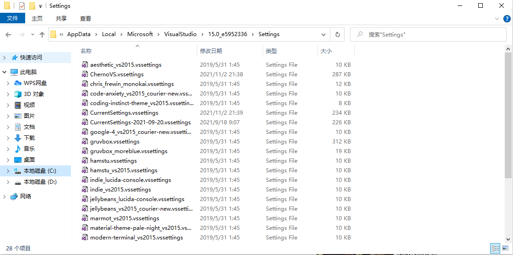
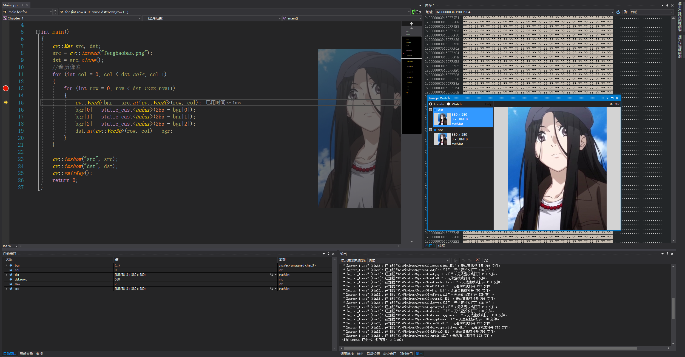

# Visual Studio 2017 插件安装


---

<h2>
    目录
</h2>


[toc]


## :one: Visual Assistant
---


<div align=center>

</div>

> 它是一款代码提示、美化、调试协助、代码生成的神器。

安装方式:

1、如果你之前安装了番茄助手，请先卸载：即找到visualassist文件夹，将其删除

2、安装该资源文件夹中的VA_X_Setup2212.exe

3、通过Everything这个工具，全局搜索VA_X.dll，找到电脑中存在的VA_X.dll，用该资源文件夹中的VA_X.dll替换它。


Key:
00001M-70NDZJ-7RRVVH-7RH4HU-37427D-3TBFTR-TAPC8P-QQM4FR-6P4Y8V-7RK7YC-YFGK8M

[参考](http://www.ucbug.com/soft/95066.html)


## :two: 背景美化插件
---

>

1、下载插件:[ClaudiaIDE](https://github.com/buchizo/ClaudiaIDE/releases/tag/Release2.2.19)

<div align=center>

</div>

2、使用命令行对下载的插件进行安装。

<div align=center>

</div>

3、安装成功结果图

<div align=center>

</div>


## :three: 自定义vssettings

---

1、下载优选的vssettings设置,目前推荐的源有两个:

+ [hey-mikey](https://github.com/hey-mikey/vssettings.git)
+ [ChernoVssettings](https://thecherno.com/vs)

2、解压后将对应的**Settings**文件放入**Visual Studio 2017**对应的**Settings**目录

``` text
路径:
C:\Users\Administrator\AppData\Local\Microsoft\VisualStudio\15.0_e5952336\Settings
```

<div align=center>

</div>

3、打开Visual Studio后,选择【工具】--->【导入和导出设置】--->【导入选定的环境设置】,点击下一步

<div align=center>

</div>

4、选择【否,仅导入新设置,覆盖我的当前设置】,点击下一步

<div align=center>

</div>

5、选择**ChernoVS.vssettins**后点击下一步,接着点击【完成】,即可成功导入。

<div align=center>

</div>

## :four: ImageWatch

---

> Image Watch适用于任何使用OpenCV图像对象的现有项目

1、[ImageWatch下载地址](https://marketplace.visualstudio.com/items?itemName=VisualCPPTeam.ImageWatch2017)

2、双击即可对其进行安装

<div align=center>

</div>

3、确保使用的是debug模式，并且在适当的位置设置的断点，在本例中在第二个for循环的位置以及第一个imshow的位置分别设置断点。调试运行至断点时即可激活image watch插件。如果没有显示Image Watch窗口，可以使用如下方法调用：【菜单栏】->【视图】->【其他窗口】->【image watch】，调出该插件。

<div align=center>

</div>


