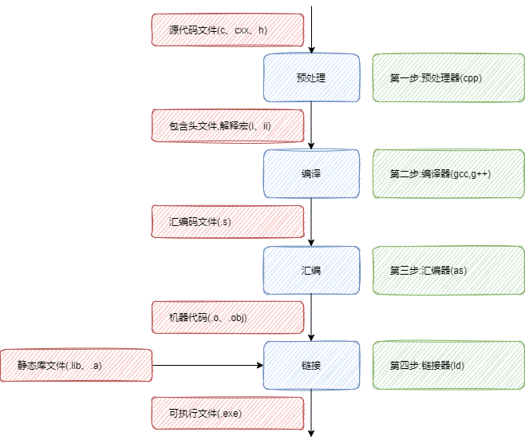

# C++ 是如何工作的  

<h2>
    目录
</h2>


- [C++ 是如何工作的](#c-是如何工作的)
  - [:zero: 简介](#zero-简介)
  - [:one: 预处理](#one-预处理)
  - [:two: 编译](#two-编译)
  - [:three: 汇编](#three-汇编)
  - [:four: 链接](#four-链接)
  - [:five: 可执行文件](#five-可执行文件)
  - [:six: gcc/g++常用配置参数](#six-gccg常用配置参数)

## :zero: 简介

---

> C++的主要编译过程分为：预处理、编译、汇编、链接这四个过程。

<div align=center>

</div>

## :one: 预处理

---

将源代码的 **.c 、.cpp 、.h** 等文件包含到一个文件中。在这个过程中会使用一些预处理指令要求编译器使用什么样的方式包含这些文件。预处理结束之后对于c语言编译器会生成一个 **.i** 文件。C++会生成 **.ii** 文件。

<h3>预编译主要工作:</h3>

+ 将所有的 **#define** 删除，并且展开所有的宏定义。
+ 处理所有条件编译指令，如 **#if，#ifdef** 等。
+ 处理 **#include** 预编译指令，将被包含的文件插入到该预编译指令的位置。该过程递归进行，及被包含的文件可能还包含其他文件。
+ 删除所有的注释 **//** 和 **\/\*\*\/**。
+ 添加行号和文件标识。如 **#2*** **“hello.c”**, 其中**2**以便于编译时编译器**产生调试用的行号信息**及用于**编译时产生编译错误或警告时能够显示行号信息**。
+ 保留所有的 **#pragma** 编译器指令，因为编译器须要使用它们。

``` c++
// -E 只预处理
g++ -E hello.cpp -o hello.i
```


## :two: 编译

---
编译过程就是把预处理完的文件进行一系列词法分析，语法分析，语义分析及优化后生成相应的汇编代码文件。

编译器对预处理器的输出进行编译，生成汇编语言（assemble language）的代码。一般来说，汇编语言的代码的文件扩展名是“.s”。

**编译的主要工作是进行语法检查，查看是否有语法错误**。特别注意一点，对于一些非本源文件中的外部函数（非本源文件中定义的函数），外部变量（非本源文件中定义的变量），编译不会去追究其定义及实现，一般只要有对应的声明，就可编译通过，甚至说外部函数没声明都可以编译通过（比如一般gcc就不会报错，只要链接能找到对应函数，仍然会生成可执行文件，但是g++就会报函数未声明的错误）。

``` C++
g++ -S hello.i -o hello.s
```

## :three: 汇编

---

汇编器是将汇编代码转变成机器可以执行的命令，每一个汇编语句几乎都对应一条机器指令。汇编相对于编译过程比较简单，根据汇编指令和机器指令的对照表一一翻译即可。

汇编语言的代码由汇编器（assembler）转换为机器语言，也就是二进制文件，这个处理过程称为汇编（assemble）。汇编器的输出称为目标文件（object file）。一般来说，目标文件的扩展名是“.o”。

Linux 中，目标文件也是 ELF 文件。使用file命令来查看目标文件，会显示ELF…relocatable，据此就能够将其和可执行文件区分开。

```c++
g++ -c hello.s -o hello.o
```


## :four: 链接

---

链接器ld将各个目标文件组装在一起，解决符号依赖，库依赖关系，并生成可执行文件。

目标文件本身还不能直接使用，无论是直接运行还是作为程序库（library）文件调用都不可以。将目标文件转换为最终可以使用的形式的处理称为链接（link）。使用程序库的情况下，会在这个阶段处理程序库的加载。


**链接是将生成的一个或者多个中间文件联合生成可执行文件**。所有的可执行文件都需要一个入口函数，在c语言里面入口函数是main函数，每个源文件都可能调用到其他源文件中的函数，所以生成的.o目标文件要进行链接，链接其他.o文件中的函数实现，最终生成一个可执行文件，链接主要工作是链接函数实现（本目标文件内部或者其他目标文件中定义的）和外部变量（函数体外的变量，也就是全局变量），进行各个目标文件的交互，具体是这样的，目标文件中的每个函数如果调用到了其他函数，那么就去链接其他的函数到本函数中，如果用到了外部的变量，那么去链接这个变量。

```C++
g++ hello.o -o hello
```

## :five: 可执行文件

---
现代的 Linux 上的可执行文件，通常是指符合 ELF（Executable and Linking Format）这种特定形式的文件。 ls、 cp 这些命令（command）对应的实体文件都是可执行文件，例如/bin/ls 和 /bin/cp 等。

使用 file 命令能够查看文件是否符合 ELF 的形式。例如，要查看 /bin/ls 文件是不是ELF，在 shell 中输入如下命令即可。

```Bash
$ file /bin/ls 
// 【输出】
$ /bin/ls: ELF 32-bit LSB executable, Intel 80386, version 1 (SYSV), for GNU/Linux 2.4.1, dynamically 
 linked (uses shared libs), for GNU/Linux 2.4.1, stripped
```

如果像这样显示 ELF……executable，就表示该文件为 ELF 的可执行文件。根据所使用的 Linux 机器的不同，可能显示 ELF 64-bit，也可能显示 ELF 32-bit MSB，这些都是ELF 的可执行文件。

ELF 文件中包含了程序（代码）以及如何运行该程序的相关信息（元数据）。程序（代码）就是机器语言（machine language）的列表。机器语言是唯一一种 CPU 能够直接执行的语言，不同种类的 CPU 使用不同的机器语言。

## :six: gcc/g++常用配置参数

``` Bash

-E 只预处理
-S 到编译
-c 到汇编
-pie 生成位置无关二进制
-shared 生产库文件
-W warning配置
-Wa,<options> 汇编配置
-Wp,<options> 预处理配置
-Wl,<options> 连接器配置
-m 交叉编译配置
-g 保留debug信息
-O1 优化级别:-O0：无优化(默认) 。 
-O和-O1：优化可执行文件大小及执行时间，
且不使编译时间明显增加。编译大型程序时会显著增加编译时内存的使用。 
-O2：包含-O1的优化，并增加无需在目标文件大小和执行速度上进行折衷的优化。
编译器不执行循环展开及函数内联，即不进行“空间换时间”的优化。该选项将增加编译时
间和目标文件的执行性能。
-Os:执行所有不增加目标文件大小的-O2选项,并执行专门减小目标文件大小的优化选项。 
-O3: 打开所有-O2优化选项并且增加 -finline-functions, -funswitch-loops,
 -fpredictive-commoning, -fgcse-after-reload和-ftree-vectorize优化选项。
 [e.g.1]gcc -O1 source.c -o exec

```