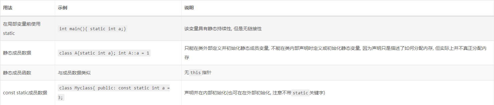

# C++ 的 static

<h2>目录</h2>

- [C++ 的 static](#c-的-static)
  - [:one: static 关键字作用是什么](#one-static-关键字作用是什么)
  - [:two: 存储持续性](#two-存储持续性)
  - [:three: 作用域和链接性](#three-作用域和链接性)
    - [静态持续性、外部链接性](#静态持续性外部链接性)
    - [静态持续性、内部链接性](#静态持续性内部链接性)
    - [静态持续性、无链接性](#静态持续性无链接性)
  - [:four: static 不同场景下使用](#four-static-不同场景下使用)
    - [全局变量、全局常量的链接性](#全局变量全局常量的链接性)
    - [函数持续性是否受static关键字的影响](#函数持续性是否受static关键字的影响)
    - [class内、struct内的static](#class内struct内的static)
      - [静态成员](#静态成员)
      - [静态函数](#静态函数)
      - [常量静态成员](#常量静态成员)

## :one: static 关键字作用是什么

---


<div align=center>

</div>

## :two: 存储持续性

---
C++使用三种（在C++11中是四种）不同的方案来存储数据，这些方案的区别就在于 **数据保留在内存中的时间**:


- 自动（automatic）存储期:在程序开始执行其所在的函数或者代码块时被创建, 在执行完函数或代码块时, 其内存会被自动释放。未声明为 static、extern 或 thread_local 的所有局部对象均拥有此存储期。
- 静态（static）存储期。在整个程序运行过程当中都存在。这类对象的存储在程序开始时分配，并在程序结束时解分配。这类对象只存在一个实例。所有声明于命名空间（包含全局命名空间）作用域的对象，加上声明带有 static 或 extern 的对象均拥有此存储期。

- 线程（thread）存储期。这类对象的存储在线程开始时分配，并在线程结束时解分配。每个线程拥有其自身的对象实例。只有声明为 thread_local 的对象拥有此存储期。 thread_local 能与 static 或 extern 一同出现，它们用于调整链接。
- 动态（dynamic）存储期。这类对象的存储是通过使用动态内存分配函数来按请求进行分配和解分配的。关于具有此存储期的对象的初始化的细节，见 new 表达式。

https://hellozhaozheng.github.io/z_post/Cpp-static%E5%85%B3%E9%94%AE%E5%AD%97/


## :three: 作用域和链接性

---

和C语言一样，C++也为 静态 存储持续性变量提供了3种链接性(其他类型的持续性变量均是无链接性的),这三种链接性都在整个程序执行期间存在，与自动变量相比，它们的寿命更长。

- 外部链接性（可在其他文件中访问）
- 内部链接性（只能在当前文件中访问）
- 无链接性（只能在当前函数或代码块中访问，与自动变量不同的是，就算不在函数中，变量也存在，只是不能访问）

由于静态变量的数目在程序运行期间是不变的，因此程序不需要使用特殊的装置（如栈）来管理它们, 而是将它们放在 全局数据区。

编译器将分配固定的内存块来存储所有的静态变量，这些变量在整个程序执行期间一直存在。另外，如果没有显式地初始化静态变量，编译器将把它设置为0。在默认情况下，静态 数组和结构将每个元素或成员的所有位都设置为0。


创建三种链接性的静态持续变量：
- 外部链接性：必须在代码块的外面声明
- 内部链接性：必须在代码块的外面声明，并使用static限定符
- 无链接性：必须在代码块内部声明，并使用static限定符


```C++

int dog = 100; // 静态持续变量 外部链接性 作用域为整个文件
static int snake = 200; // 静态持续变量 内部链接性 作用域为整个文件
namespace PPAnimal
{
	static int cat = 2; // 静态持续变量 无链接性 作用域为局部

	void print()
	{
		static int print_cnt = 1;
		std::cout << "PRINT COUNT : " << print_cnt << std::endl;
		print_cnt++;
	}
}

```

### 静态持续性、外部链接性

- 单定义规则(One Defination Rule,ODR)。变量只能定义一次。为满足这种需求，C++提供了两种变量声明：
  - 定义声明:为变量分配存储空间。
    ```C++
        double up=100;
    ```
  - 引用声明:不给变量分配存储空间，引用已有的变量。使用关键字extern
    ```C++
        extern double up;
    ```
- 多个文件使用外部变量,只需在一个文件中包含该变量的定义,但在使用该变量的其他所有文件中,都必须使用关键字extern声明它。

```C++
// FILE01.CPP

extern int cats =20;// 由于初始化,所以这里的是定义声明,去掉exter无妨
int dogs = 22;

//FILE02.CPP

extern int cats; // 此处引用声明
extern int dogs;


```

### 静态持续性、内部链接性

将作用域为整个文件的变量声明为静态外部变量（内部链接性），就不必担心其名称与其他文件中的外部变量发生冲突。

通常, 当在函数体内定义一个变量时, 该变量是一个自动存储变量, 每当运行到该语句时都会给该局部变量分配 栈内存, 而随着程序退出函数体, 系统就会自动收回这一部分内存。

但有时候我们需要在两次调用之间对变量的值进行保存。通常的想法是定义一个全局变量来实现, 但是这样一来, 变量就不再属于该函数本身了。

因此, 可以使用静态局部变量来解决, 静态局部变量保存在全局数据区, 而不是保存在栈中, 每次的值保持到下一次调用, 直到下次赋新值。


### 静态持续性、无链接性

局部静态变量：虽然该变量只在该代码块中可用，但它在该代码块不处于活动状态时仍然存在。因此在两次函数调用之间，静态局部变量的值将 保持不变 。


另外，如果初始化了静态局部变量，则程序 只在启动时进行一次初始化 。以后再调用函数时，将不会被再次初始化。


## :four: static 不同场景下使用

---

### 全局变量、全局常量的链接性

- 存储说明符
  - auto（在C++11中不再是说明符）
  - register
  - static
  - extern
  - thread_local（C++11新增的）
  - mutable：即使结构（或类）变量为const，其某个成员也可以被修改

- cv-限定符（cv-qualifer）
  - const：内存被初始化后，程序便不能再对它进行修改
  - volatile：即使程序代码没有对内存单元进行修改，其值也可能发生变化
  
- 在默认情况下 全局变量的链接性为外部，但 const全局常量的链接性为内部 (因为是全局的, 所以默认已经具有静态持续性) 。因此，将一组常量放在头文件中，其他引用该头文件的文件都相当于自己定义了私有的常量，这就是能够将常量定义放在头文件中而不会重定义的原因。
- 如果处于某种原因，程序员希望某个常量的链接性为外部的，则可以使用extern关键字来覆盖默认的内部链接性，extern const int states = 50;，在这种情况下，必须在所有使用该常量的文件中使用extern关键字来声明它。同时这种情况下就不能将该常量放在头文件中了, 因为链接性已经变成外部, 这样会引起重复定义。
- const全局常量的链接性为内部, 因此可以放在头文件中而不会重定义。


### 函数持续性是否受static关键字的影响

当static关键字作用于函数时, 它改变的只是函数的链接性, 函数的持续性永远为静态。

- C++不允许在一个函数中定义另一个函数，因此 所有函数的存储持续性都自动为静态，即在整个程序执行期间都一直存在 。
- 在默认情况下，函数的链接性为外部。即可以在文件间共享，使用extern来指出函数实在另一个文件中定义的（可选）。
- 可以使用关键字static将函数的链接性设置为内部 ，使之只能在一个文件中使用，必须同时在原型和函数定义中使用该关键字。
- 内联函数不受单定义规则的约束，这允许程序员能够将内联函数的定义放在头文件中。但是C++要求同一个函数的所有内联定义都必须相同。
- C++查找函数顺序：静态（在本文件中找）——外部（在所有的程序文件中找）——在库函数中找。因此如果定义了一个与库函数同名的函数，编译器优先使用程序员定义的版本（C++不推荐这样做）。

### class内、struct内的static

在类定义中，关键词 static 声明不绑定到类实例的成员。

#### 静态成员

类的静态成员不与类的对象关联：它们是具有静态或线程 (C++11 起)存储期的独立变量，或者常规函数。

static 关键词只会用于静态成员在类定义中的**声明**，而不用于该静态成员的**定义**：

```C++

class X {static int n;} // 声明 (使用 static)
int X::n = 1 ; // 定义 ( 不用 'static' )

```

类体内的声明不是定义，且可以将成员声明为（除 void 之外的）**不完整类型**，包括该成员的声明所在的类型:

```C++

struct Foo;
struct S
{
    static int a[];  // 声明,不完整类型
    static Foo x;    // 声明,不完整类型
    static S s;      // 声明,不完整类型(在其自身定义中)
};

int S::a[10]; // 定义,完整类型
struct Foo{};
Foo S::x;    // 定义,完整类型
S S::s;      // 定义,完整类型

```

然而如果声明使用了 constexpr 或 inline (C++17 起) 说明符，那么该成员必须声明为拥有完整类型。

指代类T的静态成员m有两种可用的形式:限定名T::m以及成员访问表达式E.m或者E->m,其中E分别是求值为T或者T*的表达式。**在同一类作用域中时,不需要限定:**

```C++

struct X
{
    static void f(); // 声明
    static int n; // 声明
};

X g() { return X(); } // 某个返回X的函数

void f()
{
    X::f(); // X::f 是静态成员函数的限定名
    g().f(); // g().f 是指代静态成员函数的成员访问表达式
}

int X::n = 7; // 定义
 
void X::f()   // 定义
{
    n = 1; // X::n 在此作用域可以只要以n的形式进行访问
}


// 静态类测试
class SCl
{
public:
	static int x; // 声明
	static double GetY() { return y; }
	static float GetZ() { return z; }
protected:
	static double y; // 声明
private:
	static float z; // 声明
};


```

静态数据成员不关联到任何对象。即使不定义类的任何对象它们也存在。整个程序中只有一个拥有静态存储期的静态数据成员实例，除非使用关键词 thread_local，此时每个线程都有一个具有线程存储期的该对象。

静态数据成员不能是 mutable 的。

在命名空间作用域中，如果类自身具有外部连接（即不是无名命名空间的成员），那么类的静态数据成员也具有**外部连接**。局部类（定义于函数内部的类）和无名类，包括无名类的成员类，不能拥有静态数据成员。

静态数据成员可以声明为 inline。 inline 静态数据成员可以在类定义中定义，而且可以指定初始化器。它不需要类外定义:

```C++

struct X
{
    inline static int n=1;
};

```

#### 静态函数

静态成员函数不关联到任何对象。调用时，它们没有 this 指针。

静态成员函数不能是 virtual、const 或 volatile 的。

静态成员函数的地址可以存储在常规的函数指针中，但不能存储在成员[函数指针](https://zh.cppreference.com/w/cpp/language/pointer#.E5.87.BD.E6.95.B0.E6.8C.87.E9.92.88)中。


#### 常量静态成员

const 只是对于单个类对象来说是常量, 而对于整个类来说实际上是变量, 如果要维护一个对于整个类来说的常量, 应该使用const static或者static cosnt(二者等价)来声明, 与普通static成员数据不太一样的是, const static成员数据需要在类中声明的同时就进行初始化(因为const数据在定义是必须初始化, 而static又使得该变量独立于具体对象, 所以必须在声明时初始化或者在类外部初始化, 也不能在构造函数初始化列表中初始化) :

```C++

struct XX
{
	const static int m = 1;  // 声明并初始化
	const static inline int n[] = {2};
	const static int z{3};
	const static int k;
};
const int XX::k = 2;  //在类外部初始化. 不要带static关键字

```


